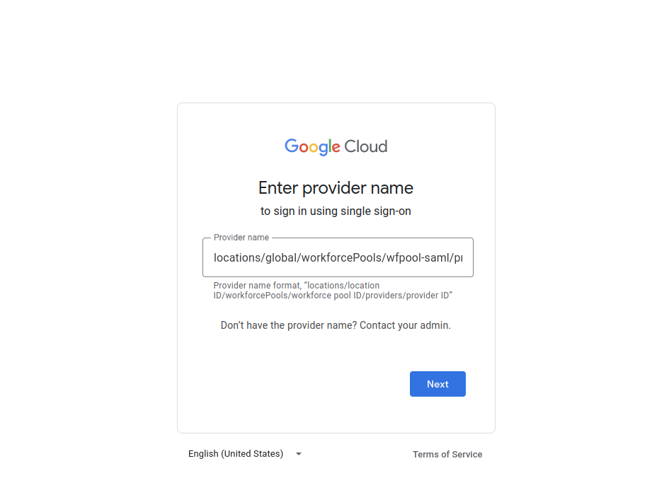
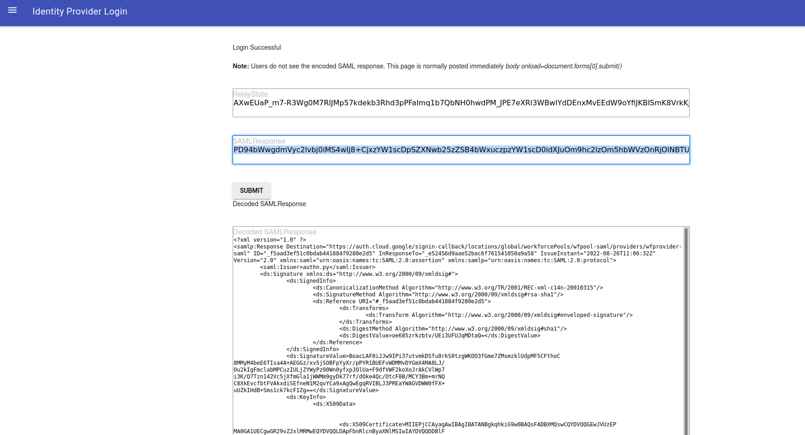
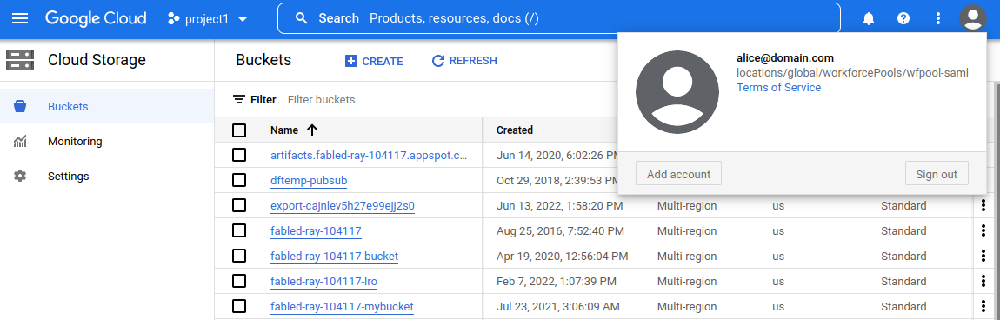
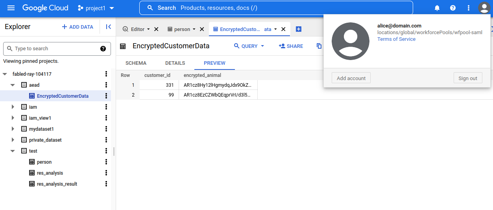
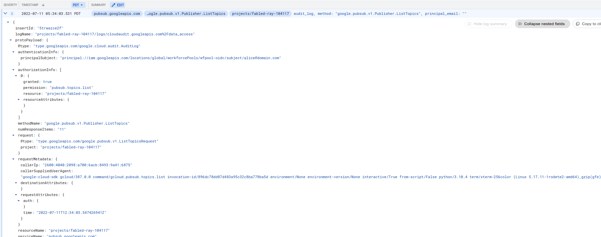
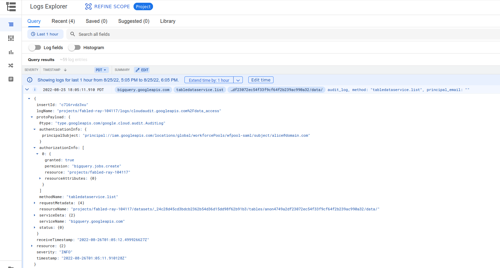

## Using Google Cloud WorkforcePools with SAML

A sample demo of using GCP [WorkForce Identity Federation](https://cloud.google.com/iam/docs/workforce-identity-federation) using a local `SAML IDP server`.

`Workforce Identity Federation` allows you to manage GCP Resource through `gcloud` cli or `Google Cloud Console` using your own SSO system and Identity Provider.   While you can import, map and and synchronize your users in your own `Active Directory`, `SAML` or `OIDC` based identity provider into [Google Cloud Identity](https://cloud.google.com/architecture/identity/federating-gcp-with-active-directory-synchronizing-user-accounts), you still need to synchronize users, groups and what not.

With Work**Force** Identity, you still retain your users in your IDP but instead of synchronizing users, you will map and federate login and access to GCP resources.  In this mode, you still use your own SSO system but access to the resource is using a federated identity binding.

Note, this is about Work_Force_ Federation (users).  Work_Load_ federation is more services accessing GCP Resources (https://cloud.google.com/iam/docs/workload-identity-federation).   WorkForce operates at the organization level while WorLoad is at the project level.


>> The sample SSO Servers here is NOT supported by google!  Just in non-prod and even then just to test; remember to remove the configuration.

What this article shows is a trivial WorkForce Federation configuration using a standalone SAML SSO IDP server i wrote maybe 10years ago. 

In this flow, we will configure your cloud organization to accept your own  IDP that is running locally and access GCP through `gcloud` and `Cloud Console`.

For example, you can map your user to a `principal://` (user) or use group claims to map to a group `principalSet://`

so a mapped user

 `alice@domain.com` -> `principal://iam.googleapis.com/locations/global/workforcePools/$POOL_ID/subject/alice@domain.com`

can then be bound to a GCP resource's IAM:

```bash
gcloud projects add-iam-policy-binding  $PROJECT_ID   \
    --member='principal://iam.googleapis.com/locations/global/workforcePools/$POOL_ID/subject/alice@domain.com' \
	--role='roles/pubsub.viewer'
```


You'll need access to a cloud org to create the configuration...

>>> **NOTE** I do NOT really expect you to configure this end-to-end using a demo SSO provider here with the built-in certificates.  While you can follow this end-to-end, atleast generate your own certificates (eg, `server.crt`, `server.key` and then use that public cert in `iap_metadata.xml` file).  Once you i would recommend immediately disabling the configuration...or atleast 


---

### References

`Workload Identity`
  * [GCP Workload Identity Federation using SAML](https://blog.salrashid.dev/articles/2022/gcpcompat-saml/)
  * [Understanding workload identity federation](https://blog.salrashid.dev/articles/2021/understanding_workload_identity_federation/)
[Create Root CA Key and cert](https://github.com/salrashid123/ca_scratchpad)
---


### Setup


To set this up, you need to be a domain admin and pick a project where we will access resources:


```bash
gcloud config set account admin@yourdomain.com
gcloud config set project host_project_id

export GCLOUD_USER=`gcloud config get-value core/account`
export PROJECT_ID=`gcloud config get-value core/project`
export PROJECT_NUMBER=`gcloud projects describe $PROJECT_ID --format='value(projectNumber)'`


$ gcloud organizations list
    DISPLAY_NAME               ID  DIRECTORY_CUSTOMER_ID
    yourdomain.com  673208781234              C023zw3bc

# if your org id is 673208781234
export POOL_ID=wfpool-saml
export PROVIDER_ID=wfprovider-saml
export LOCATION=global
export BILLING_PROJECT_ID=$PROJECT_ID
export ORGANIZATION_ID=673208781234

gcloud config set billing/quota_project $BILLING_PROJECT_ID

gcloud organizations add-iam-policy-binding \
    --member "user:$GCLOUD_USER" --role roles/iam.workforcePoolAdmin 
```


### Configure the SAML provider

The SAML IDP server we will use here will run locally with docker:

* [UI SAML SSO Server](https://github.com/salrashid123/googlapps-sso):  
  this SSO server will use a UI login screen.  We will use this for Console access redirect
* [CLI SAML SSO Server](https://github.com/salrashid123/gcpcompat-saml): 
  this SSO server is purely command line and 'Just issues" a SAML Assertion for you automatically.  
  Simulates some other external process "just creating" a saml assertion which will get written to a file. 
  This is used by `gcloud`.  You can ofcourse use the GUI login and then "copy and paste" the encoded assertion to the file

We will be using the same `idp_metadata.xml` file with the same certificate here for simplicity


So first get both:

```bash
git clone https://github.com/salrashid123/gcpcompat-saml
git clone https://github.com/salrashid123/googlapps-sso
```

Edit `/etc/hosts`

```
127.0.0.1	sso.idpdomain.com
```

Now create the pools and providers
```bash
gcloud beta iam workforce-pools create $POOL_ID \
    --location="global" --organization=$ORGANIZATION_ID  \
    --description="WorkForce Pool SAML" \
    --display-name="WorkForce Pool SAML" --billing-project=$BILLING_PROJECT_ID


gcloud iam workforce-pools providers create-saml  $PROVIDER_ID \
   --location=global  \
   --workforce-pool  $POOL_ID \
   --display-name "idp-us-employees-saml" \
   --description "IdP for Acme US employees SAML" \
    --idp-metadata-path="idp_metadata.xml" \
    --attribute-mapping="google.subject=assertion.subject,google.groups=assertion.attributes['mygroups']"  \
	--project $PROJECT_ID --billing-project=$BILLING_PROJECT_ID
```

Create bindings for the `principal://` to some resources in a givne project
```bash
gcloud projects add-iam-policy-binding  $PROJECT_ID   \
    --member='principal://iam.googleapis.com/locations/global/workforcePools/$POOL_ID/subject/alice@domain.com' \
	--role='roles/pubsub.viewer'

gcloud projects add-iam-policy-binding  $PROJECT_ID    \
    --member='principal://iam.googleapis.com/locations/global/workforcePools/$POOL_ID/subject/alice@domain.com' \
	--role='roles/storage.objectViewer'


gcloud projects add-iam-policy-binding  $PROJECT_ID   \
    --member='principal://iam.googleapis.com/locations/global/workforcePools/$POOL_ID/subject/alice@domain.com' \
	--role='roles/serviceusage.serviceUsageConsumer'


gcloud projects add-iam-policy-binding  $PROJECT_ID  \
     --member='principal://iam.googleapis.com/locations/global/workforcePools/$POOL_ID/subject/alice@domain.com'  \
	 --role='roles/viewer'
```

#### Start Console IDP

Now start the IDP docker container

```
cd googleapps-sso
  docker run -t -p 28080:28080 \
    -v `pwd`:/app/:ro \
    --entrypoint=/app/saml_idp_gsuites.py \
    salrashid123/appssso \
    --debug  \
    --cert_file=/app/server.crt \
    --key_file=/app/server.key
```

Goto:

* [https://auth.cloud.google/signin?continueUrl=https://console.cloud.google](https://auth.cloud.google/signin?continueUrl=https://console.cloud.google)


and enter in your provider `locations/global/workforcePools/$POOL_ID/providers/$PROVIDER_ID`





Once you enter that in, you should get redirected to the SSO login.  Enter in `alice@domain.com` and you should see a interstitial page here




Click continue...you should be on a modified console where you can view resources on 

- `GCS`




- `BQ`



- `PubSub`



If you enabled audit logs, you'll see access to the resources as the federated `principal://`




### gcloud CLI

For gcloud CLI, we need someway to pump the SAML Assertion  to a file or accessible via website:

In our case, we'll pump it to a file

```bash
cd gcpcompat-saml
export SAML_TOKEN=`docker run -t -v $PWD:/app/:ro     --entrypoint=/app/getsamlassertion.py     salrashid123/appssso     --debug      --cert_file=/app/server.crt     --key_file=/app/server.key --user=alice@domain.com  --audience=https://iam.googleapis.com/locations/global/workforcePools/$POOL_ID/providers/$PROVIDER_ID`

echo $SAML_TOKEN

echo -n $SAML_TOKEN > /tmp/samlassertion.txt
```


Now create an ADC and gcloud config:

```bash
gcloud iam workforce-pools create-cred-config \
    locations/global/workforcePools/$POOL_ID/providers/$PROVIDER_ID \
    --output-file=sts-creds-saml.json \
    --credential-source-file="/tmp/samlassertion.txt" \
    --credential-source-type=text \
    --workforce-pool-user-project $BILLING_PROJECT_ID \
    --subject-token-type=urn:ietf:params:oauth:token-type:saml2 \
    --output-file=saml-creds.json
```

Now login to gcloud CLI

```bash
gcloud auth login --cred-file=saml-creds.json
```

You should see the `principal://` for this user and access all the same resources as in the console


```bash
$ gcloud pubsub topics list --billing-project=$BILLING_PROJECT_ID

$ gcloud alpha bq  tables list --dataset=test --billing-project=$BILLING_PROJECT_ID
```

### curl

If you want to see the same STS flow using `curl`:

```bash
curl -s https://sts.googleapis.com/v1/token \
--data-urlencode "audience=//iam.googleapis.com/locations/$LOCATION/workforcePools/$POOL_ID/providers/$PROVIDER_ID" \
--data-urlencode "grant_type=urn:ietf:params:oauth:grant-type:token-exchange" \
--data-urlencode "requested_token_type=urn:ietf:params:oauth:token-type:access_token" \
--data-urlencode "scope=https://www.googleapis.com/auth/cloud-platform" \
--data-urlencode "subject_token_type=urn:ietf:params:oauth:token-type:saml2" \
--data-urlencode "subject_token=$SAML_TOKEN"  \
--data-urlencode "options={\"userProject\":\"$BILLING_PROJECT_ID\"}"  | jq -r '.access_token' 

### enter the STS TOKEN returned into an env-var
export STS_TOKEN="the_token"
```

Now use the `STS_TOKEN` in GCP API calls

```bash
curl  -H "X-Goog-User-Project: $PROJECT_NUMBER"   -H "Authorization: Bearer $STS_TOKEN"    https://pubsub.googleapis.com/v1/projects/$PROJECT_ID/topics

curl  -H "X-Goog-User-Project: $PROJECT_NUMBER" \
  -H "Authorization: Bearer $STS_TOKEN" \
    https://bigquery.googleapis.com/bigquery/v2/projects/$PROJECT_ID/datasets/test/tables 
```


You can also access resource using `Application Default Credentials`

```bash
export GOOGLE_APPLICATION_CREDENTIALS=$PWD/sts-creds.json

# with curl
curl  -H "X-Goog-User-Project: $PROJECT_NUMBER"  \
    -H "Authorization: Bearer `gcloud auth application-default print-access-token`"    https://pubsub.googleapis.com/v1/projects/$PROJECT_ID/topics

curl  -H "X-Goog-User-Project: $PROJECT_NUMBER"  \
   -H "Authorization: Bearer `gcloud auth print-access-token`"    https://pubsub.googleapis.com/v1/projects/$PROJECT_ID/topics

# with cloud-sdk app; edit main.go and enter the projectID
cd client/
go run main.go
```

---

### Mapping Group Attributes

The default tutorial here maps just a single user over:

 `alice@domain.com` -> `principal://iam.googleapis.com/locations/global/workforcePools/$POOL_ID/subject/alice@domain.com`

The more efficient way is to map a SAML attribute that identifies the groups the user is in and then bind the IAM permission to the group label.

In this you can configure a [attribute mapping](Ihttps://cloud.google.com/iam/docs/configuring-workload-identity-federation#mappings-and-conditions) using a `principalSet://`


Remember we configured the provider with an attribute mappeing

```
    --attribute-mapping="google.subject=assertion.subject,google.groups=assertion.attributes['mygroups']"
```


What that means is that google will use the assertions `Attribute` value for `groups` to extract/enumerate the values


```xml
		<saml:AttributeStatement>
			<saml:Attribute Name="mygroups">
				<saml:AttributeValue>ssoappgroup</saml:AttributeValue>
				<saml:AttributeValue>group1_3</saml:AttributeValue>
			</saml:Attribute>
		</saml:AttributeStatement>
```

Meaning that the you can make a binding like this

```bash
gsutil iam ch \
   prinicpalSet://iam.googleapis.com/locations/global/workforcePools/$POOL_ID/group/ssogroup:objectValue \
    gs://$PROJECT_ID-bucket
```

### Enable/Disable 

If you've made it this far, disable the config:

```bash
gcloud  iam workforce-pools providers update-saml  $PROVIDER_ID \
  --location=$LOCATION  --workforce-pool  $POOL_ID \
   --billing-project=$BILLING_PROJECT_ID --disabled

 gcloud beta iam workforce-pools  update   $POOL_ID \
     --location="global"  --billing-project=$BILLING_PROJECT_ID --disabled 

### if you want to reenable, use curl, the update via gcloud doens't support the fieldmask

curl -X PATCH -H "Authorization: Bearer `gcloud auth print-access-token`" \
  -H "X-Goog-User-Project: $BILLING_PROJECT_ID" -d '{"disabled": false}'  \
   -H "content-type: application/json" \
    "https://iam.googleapis.com/v1/$LOCATION/workforcePools/$POOL_ID?alt=json&updateMask=disabled"

curl -X PATCH -H "Authorization: Bearer `gcloud auth print-access-token`" \
   -H "X-Goog-User-Project: $BILLING_PROJECT_ID" -d '{"disabled": false}'  \
    -H "content-type: application/json"  \
	 "https://iam.googleapis.com/v1/locations/$LOCATION/workforcePools/$POOL_ID/providers/$PROVIDER_ID?alt=json&updateMask=disabled"

```

Thats it! i'm headed to a winery now

---

### Appendix

#### Sample SAML Assertion

```xml
<?xml version="1.0" ?>
<samlp:Response Destination="https://auth.cloud.google/signin-callback/locations/global/workforcePools/$POOL_ID/providers/$PROVIDER_ID" ID="_3489c1e22804c977323419a535f36fa" InResponseTo="_3ed7d72d358088134ec5efc0b7f4aef" IssueInstant="2022-08-26T10:51:16Z" Version="2.0" xmlns:saml="urn:oasis:names:tc:SAML:2.0:assertion" xmlns:samlp="urn:oasis:names:tc:SAML:2.0:protocol">
	<saml:Issuer>authn.py</saml:Issuer>
	<ds:Signature xmlns:ds="http://www.w3.org/2000/09/xmldsig#">
		<ds:SignedInfo>
			<ds:CanonicalizationMethod Algorithm="http://www.w3.org/TR/2001/REC-xml-c14n-20010315"/>
			<ds:SignatureMethod Algorithm="http://www.w3.org/2000/09/xmldsig#rsa-sha1"/>
			<ds:Reference URI="#_3489c1e22804c977323419a535f36fa">
				<ds:Transforms>
					<ds:Transform Algorithm="http://www.w3.org/2000/09/xmldsig#enveloped-signature"/>
				</ds:Transforms>
				<ds:DigestMethod Algorithm="http://www.w3.org/2000/09/xmldsig#sha1"/>
				<ds:DigestValue>Lpjk/OsP0nnAanjTLBGwOAJn6k8=</ds:DigestValue>
			</ds:Reference>
		</ds:SignedInfo>
		<ds:SignatureValue>XmpU6OIzuSPaPUcov9a1+9iJmZKCVcEi9Dz4zh6PrSK/Hnq+W0cSCl6d59XrBMtc
voZ+pel6aT0AtlTFEqJuQkgFZ1u95I/U+aNxTSZv83GLr56JoD0zA2QQysnO2SjE
yLJcr/QWnyj3CqSVqt+dG/y1vmnRF71KFrcPGCI8cjGJd43khyri9mntEQqDlN3m
RlzWK2El0lUvXdTGE5wealOkhSrB6JMpOhdscJ4N5mnA8UliBKCZb0adf6UJM2Mn
zK01X5mPlxgbPW6An9AhVWHEE6pO6SWljSQnqR4DDrT4y815JbCRmULss4nHSPZy
w+3cxtxcxCIEhXjXKlTWPg==</ds:SignatureValue>
		<ds:KeyInfo>
			<ds:X509Data>
				

				<ds:X509Certificate>MIIEPjCCAyagAwIBAgIBATANBgkqhkiG9w0BAQsFADBXMQswCQYDVQQGEwJVUzEP
MA0GA1UECgwGR29vZ2xlMRMwEQYDVQQLDApFbnRlcnByaXNlMSIwIAYDVQQDDBlF
bnRlcnByaXNlIFN1Ym9yZGluYXRlIENBMB4XDTIyMDEwOTIyMTAzNloXDTI3MDcw
MjIyMTAzNlowUzELMAkGA1UEBhMCVVMxDzANBgNVBAoMBkdvb2dsZTETMBEGA1UE
CwwKRW50ZXJwcmlzZTEeMBwGA1UEAwwVc2VydmVyLnlvdXJkb21haW4uY29tMIIB
IjANBgkqhkiG9w0BAQEFAAOCAQ8AMIIBCgKCAQEAw0PQuP452qvSZetyW/hqFIkg
CCSc+6Ryw+rRPUIcVZIuibonJeSJe+TXPvonUEzAgpt858ji+FUsFVDsLmcX2yLF
DO0AtV3JA04wbJb8bSujvVstzpVAvY/gIAADrs8gqybekgSnUxOtXlFeYmYjxdNF
sx1qFqaE0nrRJzZIlarhaym38+Tta5+rJPlrZKOVoCgOqAYyQ5LH0/epEJh5U2Du
g2aZRcdULdqORbftDqqliheG2atd/tCQxKxVHQrRnWmnyE0ZJEpnn9/faSX8vqtz
Zu/5Z4FUt5TcyB9dyKrvaKjGwM6ON+5QYsKI08FxlqQ/Uhp5PrRFni5TCmfJWQID
AQABo4IBFzCCARMwDgYDVR0PAQH/BAQDAgeAMAkGA1UdEwQCMAAwEwYDVR0lBAww
CgYIKwYBBQUHAwEwHQYDVR0OBBYEFEmBqhsOJAb2CGD7SiVS0tnJbQNOMB8GA1Ud
IwQYMBaAFLe6sAKh5740xsEFXGZ45btTXaFUMEQGCCsGAQUFBwEBBDgwNjA0Bggr
BgEFBQcwAoYoaHR0cDovL3BraS5lc29kZW1vYXBwMi5jb20vY2EvdGxzLWNhLmNl
cjA5BgNVHR8EMjAwMC6gLKAqhihodHRwOi8vcGtpLmVzb2RlbW9hcHAyLmNvbS9j
YS90bHMtY2EuY3JsMCAGA1UdEQQZMBeCFXNlcnZlci55b3VyZG9tYWluLmNvbTAN
BgkqhkiG9w0BAQsFAAOCAQEAghT4lTRNTN95pVLFqvopmuOhxt+MJVzGeeIwOZCH
IP2GOWzucuHqxyhlvDHtDmJSGB4tsC5EExZ+nThQdNiLB0QfMzj+OHUQHeA3RQp5
NgK3/Cvhzjd0zptC9X2pFC1vIRdvS+qGQMUbre0gZ01WCrd6p4WDRy8rblB9aW7J
OVgo6zV+4yAgson4RYa70N7HlcWgwfYmlS6YhRNJKMJbjDSFj1aA8HkCoUQZlkES
VT642mI/pwjL2U6eEyDVL0v+2yeDAsP4Jg+TdjNXumbLiWYIDUVa19Eqaz4LeXB+
T1Y96kb1pfIDuUf92nSnoUmTn4cijwdub8WqlJXX9Q6RNw==</ds:X509Certificate>
				

			</ds:X509Data>
		</ds:KeyInfo>
	</ds:Signature>
	<samlp:Status>
		<samlp:StatusCode Value="urn:oasis:names:tc:SAML:2.0:status:Success"/>
	</samlp:Status>
	<saml:Assertion ID="_e0fbbfdc800f225dfad2e02007ec1db" IssueInstant="2022-08-26T10:51:16Z" Version="2.0">
		<saml:Issuer>authn.py</saml:Issuer>
		<saml:Subject>
			<saml:NameID>alice@domain.com</saml:NameID>
			<saml:SubjectConfirmation Method="urn:oasis:names:tc:SAML:2.0:cm:bearer">
				<saml:SubjectConfirmationData InResponseTo="_3ed7d72d358088134ec5efc0b7f4aef" NotOnOrAfter="2022-08-26T11:41:16Z" Recipient="https://auth.cloud.google/signin-callback/locations/global/workforcePools/$POOL_ID/providers/$PROVIDER_ID"/>
			</saml:SubjectConfirmation>
		</saml:Subject>
		<saml:Conditions NotBefore="2022-08-26T10:51:16Z" NotOnOrAfter="2022-08-26T11:41:16Z">
			<saml:AudienceRestriction>
				<saml:Audience>https://iam.googleapis.com/locations/global/workforcePools/$POOL_ID/providers/$PROVIDER_ID</saml:Audience>
			</saml:AudienceRestriction>
		</saml:Conditions>
		<saml:AuthnStatement AuthnInstant="2022-08-26T10:51:16Z" SessionIndex="_e0fbbfdc800f225dfad2e02007ec1db">
			<saml:AuthnContext>
				<saml:AuthnContextClassRef>urn:oasis:names:tc:SAML:2.0:ac:classes:Password</saml:AuthnContextClassRef>
			</saml:AuthnContext>
		</saml:AuthnStatement>
		<saml:AttributeStatement>
			<saml:Attribute Name="mygroups">
				<saml:AttributeValue>ssoappgroup</saml:AttributeValue>
				<saml:AttributeValue>group1_3</saml:AttributeValue>
			</saml:Attribute>
		</saml:AttributeStatement>
	</saml:Assertion>
</samlp:Response>

```

